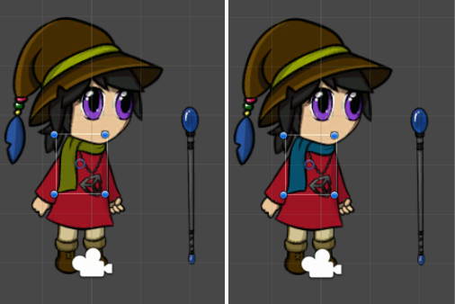
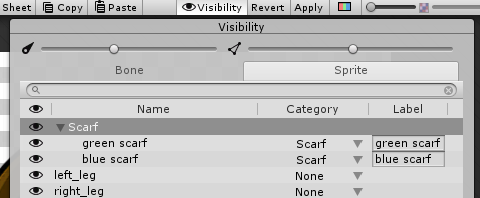

# Changing Parts of a Character

You can use __Sprite Swap__ to quickly change only one Sprite on the character Prefab without affecting the other Sprites. This means you can alter part of a character’s appearance (for example, change a scarf to a different color) while the rest of the character remains the same. 

In the following example, we have two Sprites that are variations of the character’s scarf - one green and one blue. This workflow demonstrates how to switch from one to the other in the same Prefab.

 __Left:__ The original green scarf. __Right:__ An alternate blue scarf.

1. Place the Sprites for both scarves into the same Sprite Library Asset, and add them both to the same Category named ‘Scarf’. You can do this directly in the Skinning Editor via the Sprite tab in the [Sprite Visibility panel](SpriteVis.md).
   
2. Give each of the Sprites a unique __Label__.

   

   

3. In the __Scene__, select the character Prefab and then select the ‘Scarf’ GameObject the Hierarchy window.

4. Go to the [Sprite Resolver component](SLAsset.html#sprite-resolver-component) of the ‘Scarf’ GameObject. The __Sprite Resolver__‘s visual selector displays the two Sprites available in the ‘Scarf’ __Category__.

   

5. Select the ‘blue scarf’ to switch the Sprite rendered by the ‘Scarf’ GameObject to it instead.

    Sprite Resolver’s Label set to ‘blue scarf’.
