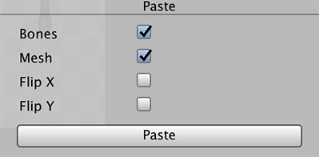

# Reusing Animations

To begin animating, drag the imported character Prefab into the Scene view. Unity generates a GameObject for each Sprite in the Prefab and [different Assets and components](SLAsset.md). With the new GameObject in the Scene, you can begin animating it with the [Unity animation workflow and tools](https://docs.unity3d.com/Manual/AnimationSection.html).

After you have [setup the animation skeleton and bone weights](CharacterRig.md) for your character, you can reuse the same rigged skeleton with other character Prefabs by using the [Copy](SkinEdToolsShortcuts.html#editor-toolbar) and [Paste](SkinEdToolsShortcuts.html#editor-toolbar) options on the [editor toolbar](SkinEdToolsShortcuts.html#editor-toolbar). This is useful if you need to quickly create characters that share the same build and animations.

This can only be done if the source and destination Prefabs have the same number of Sprites. The following functions then occur when you __Paste__ the __Copy__ data:

1. Copied bone data is pasted to the destination.
2. Mesh, weights, and bone association of source Sprite(s) are pasted to destination Sprite(s) with the same names.

## Copy

To copy a Sprite's data, select a Sprite and then select the __Copy__ button to copy the Mesh and bone data associated with that Sprite. If no Sprite is selected, the data of all the Sprites' currently in the [Skinning Editor](SkinningEditor.md) window is copied.

## Paste

To paste Sprite data to another Sprite, select the Sprite that should receive the paste data and then select __Paste__. This will bring up the Paste panel at the bottom right of the editor window:

 Paste dialog box.

| __Option__ | Function                                      |
| ---------- | --------------------------------------------- |
| __Bones__  | Paste bone data.                              |
| __Mesh__   | Paste Mesh data.                              |
| __Flip X__ | Paste the data but mirrored along the X-axis. |
| __Flip Y__ | Paste the data but mirrored along the Y-axis. |

The __Copy__ and __Paste__ tools behave in the following ways depending on these factors:

|                                   | Copy from a selected Sprite                                  | Copy with no Sprite selected                                 |
| --------------------------------- | ------------------------------------------------------------ | ------------------------------------------------------------ |
| __Paste with a Sprite selected__  | Data from the source Sprite will be copied to the selected destination Sprite. | Data is pasted to all Sprites at the destination with the same name(s) as the respective source Sprites. |
| __Paste with no Sprite selected__ | No data is pasted.                                           | Data is pasted to all Sprites at the destination with the same name(s) as the respective source Sprites. |