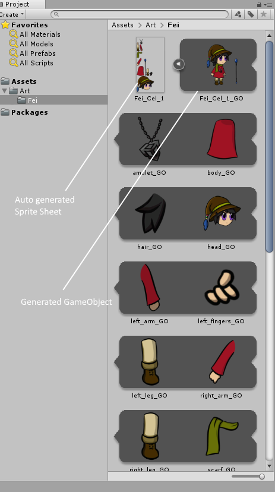
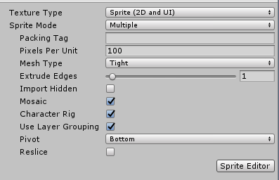

# Preparing and importing artwork

To animate a character with the __2D Animation__ package, it is recommended to separate the individual parts of your character onto different [Layers](https://helpx.adobe.com/photoshop/using/layer-basics.html) in Photoshop (see Example 1). The [PSD Importer](https://docs.unity3d.com/Packages/com.unity.2d.psdimporter@latest) imports the graphic data from each Photoshop Layer as Sprites, and automatically arranges the Sprites into both a Sprite Sheet, and a Prefab with the Sprites in the Layers’ original positions (see Example 2).

 Example 1: Layered character artwork in Adobe Photoshop.

 Example 2: The different parts/Layers of the character arranged into a Sprite Sheet.

## Photoshop file and PSD Importer settings

It is recommended to prepare your character artwork by separating the character’s various limbs or accessories into separate [layers](https://helpx.adobe.com/photoshop/using/layer-basics.html), and arranged into its default pose.

1. Save your artwork as a .psb file in Adobe Photoshop by selecting the __Large Document Format__ under the __Save As__ menu. You can convert an existing .psd file to .psb in the same way.
2. [Import](https://docs.unity3d.com/Manual/ImportingAssets.html) the .psb file into Unity with the [PSD Importer](https://docs.unity3d.com/Packages/com.unity.2d.psdimporter@latest/), which generates a Prefab containing Sprites based on the layers of the source file. 
3. Select the generated character Prefab and go to its Inspector window. In the Inspector window, ensure the following settings are set:
    * Set Texture Type to __Sprite(2D and UI)__. 
    
    * Set Sprite Mode to __Multiple__.
    
    * Check the __Mosaic__ checkbox.
    
    * Check the __Character Rig__ checkbox.
    
    * Check the __Use Layer Grouping__ checkbox if you want to preserve any Layer Groups in the source .psb file.
      
       Importer window settings

Click __Apply__ to apply the settings. Refer to the [PSD Importer](https://docs.unity3d.com/Packages/com.unity.2d.psdimporter@latest) documentation for more details about specific importer settings.