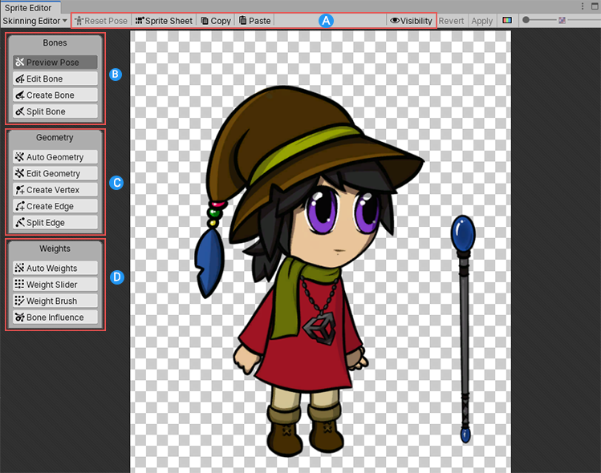
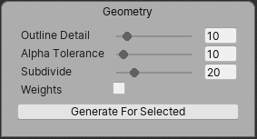
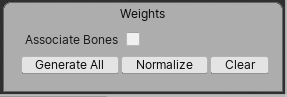
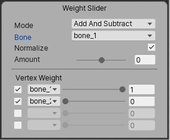
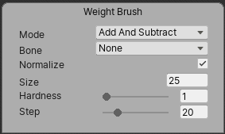
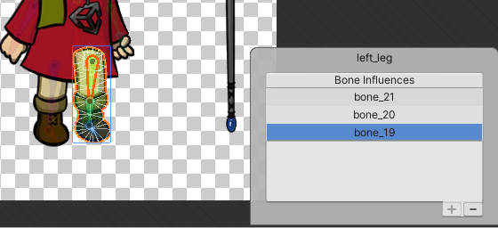
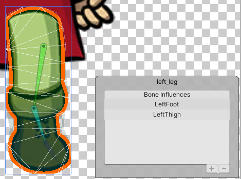
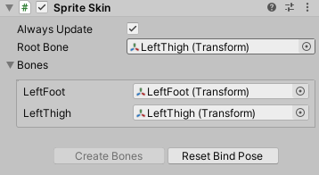

# Editor tools and shortcuts

 Labelled 2D Animation Skinning editor tools

The Skinning Editor tools are split-up into the following groups:

A. [Editor toolbar](#editor-toolbar)

B. [Bone tools](#bone-tools)

C. [Geometry tools](#geometry-tools)

D. [Weight tools](#weight-tools)

## Editor toolbar

This is toolbar that contains the options that affect what is overall visible in the __Skinning Editor__ window, as well as the __Copy__ and __Paste__ functions.

| __Tool__                                                     | __Default Shortcut__ | __Function__                                                 |
| ------------------------------------------------------------ | -------------------- | ------------------------------------------------------------ |
|  __Reset Pose__ | Shift + 1            | Restore a character’s bones and joints to their original positions. |
|  __Toggle View Mode__ | Shift + 2            | Switch between the __Character__ and __Sprite Sheet__ view modes. |
|  __Copy__                   | Ctrl + C             | Copies the bone and mesh data from the current selection.    |
|  __Paste__                | Ctrl + V             | Pastes the copied bone and mesh data to the current selection. |
|  __Paste__                | Shift + B            | Use this shortcut to show additional pasting options.        |
|  __Visibility__ | Shift + P            | Toggles the [Sprite visibility panel](SpriteVis.md), which controls the visibility of the Sprite Meshes and bones in the editor window. |
| __Toggle Tool Text__                                         | Shift + `            | Show or hide text on tool buttons.                           |

## Bone tools

Use the __Bone Tools__ to create and edit the bones of your character and their hierarchy.

| __Tool__                                                     | __Default Shortcut__ | __Function__                                                 |
| ------------------------------------------------------------ | -------------------- | ------------------------------------------------------------ |
|  __Preview Pose__ | Shift + Q            | Preview character poses after rigging.                       |
|  __Edit Bone__   | Shift + W            | Reposition the bones into a new position. These changes are automatically saved as the default bind pose for the Restore Bind Pose tool.Sprite geometry does not deform with the bones in this mode, even if the bones are attached as influencers. |
|  __Create Bone__ | Shift + E            | Click and drag to create bones.                              |
|  __Split Bone__  | Shift + R            | Splits the selected bone.                                    |

### Bone panel

The __Bone panel__ appears at the bottom right of the editor window when you have a bone selected.

| Property  | Function                                                     |
| --------- | ------------------------------------------------------------ |
| __Name__  | Displays the name of the selected bone. Enter a new name here to rename the selected bone. |
| __Depth__ | Displays the Depth value of the selected bone that determines its render order, or enter a new value (which can be negative) to change the render order. See the [bone tab and hierarchy tree](SpriteVis.html#bone-tab-and-hierarchy-tree) page for more information about how the Depth value affect the way the Sprite Mesh is rendered and deformed. |

## Geometry tools

Use the __Geometry tools__ to generate and edit the meshes of the different Sprites that make up your character.

| __Tool__                                                     | __Default Shortcut__ | __Function__                                                 |
| ------------------------------------------------------------ | -------------------- | ------------------------------------------------------------ |
|  __Auto Geometry__ | Shift + A            | Select to auto-generate Meshes for Sprites. When this tool is selected, the [Geometry panel](#geometry-panel) becomes available at the bottom-right of the __Skinning Editor__. |
|  __Edit Geometry__ | Shift + S            | Edit generated Meshes by repositioning vertices.             |
|  __Create Vertex__ | Shift + D            | Create new vertices to create geometry.                      |
|  __Create Edge__ | Shift + G            | Create new edges to create geometry.                         |
|  __Split Edge__  | Shift + H            | Split an existing edge into two.                             |

### Geometry panel

The __Geometry panel__ is only visible when __Auto Geometry__ is enabled. It contains the available settings that affect how the geometry of selected Sprites are generated.

 Visible only when Auto Geometry is enabled.

| __Property__                                       | __Function__                                                 |
| -------------------------------------------------- | ------------------------------------------------------------ |
| __Outline Detail__                                 | Use the slider to adjust the accuracy of the generated geometry’s outline to the outline of the Sprite. Smaller values create simpler outlines, while larger values create denser outlines that fit to the Sprite’s outline more accurately. |
| __Alpha Tolerance__                                | Use the slider to set the alpha value threshold to consider when generating geometry. Pixels with an alpha value lower than the set tolerance value are considered transparent during outline detection when the geometry is generated. |
| __Subdivide__                                      | Use the slider to adjust the tessellation of the Sprite Mesh by adding or decreasing the number of vertices inside the generated Mesh. |
| __Weights__                                        | Enable to automatically assign weights between the generated geometry Mesh and nearby bones. |
| __Generate For Selected/Generate For All Visible__ | Select this button to generate a geometry Mesh for selected Sprites based on the property settings above. To generate geometry for all Sprites in the Skinning Editor, do not have any Sprite selected when you select this button. |

## Weight tools

Vertices in the generated geometry meshes are influenced by different bones which affect how the meshes deform during animation. The percentage of influences from different bones for each vertex is contained in the weight information assigned to that vertex, which you can control with the following weight tools.

To add weights to your Sprites, you can first ensure that there are [bones](#bone-tools) overlaying the Sprites and [geometry](#geometry-tools) has been generated.

| __Tool__                                                     | __Default Shortcut__ | __Function__                                                 |
| ------------------------------------------------------------ | -------------------- | ------------------------------------------------------------ |
|  __Auto Weights__ | Shift + Z            | Auto-generate weights between the geometry and bones. When this tool is selected, the [Weights panel](#weights-panel) becomes available at the bottom-right of the __Skinning Editor__ that displays the available settings and the option to generate weights for |
|  __Weight Slider__ | Shift + X            | Use the slider to adjust weights.                            |
|  __Weight Brush__ | Shift + N            | Adjust weights by painting with a brush.                     |
|  __Bone Influence__ | Shift + V            | Select which bones influence a Sprite.                       |

### Weights panel

The weights panel appears at the lower-right of the Sprite Editor window when __Auto Weights__ is selected.

| __Property__              | __Function__                                                 |
| ------------------------- | ------------------------------------------------------------ |
| __Associate Bones__       | Select this box to automatically associate bones to the Sprite geometry they overlay. |
| __Generate/Generate All__ | Select this button to generate weights for the currently selected Sprite, or for all Sprites if no Sprite is selected. This does not do anything if [geometry has not been generated](#geometry-tools) for the Sprites, or if no bones are associated with the Sprite geometry. |
| __Normalize__             | Normalizes the weights of the selected Sprite, or all Sprites if no specific Sprite is selected. |
| __Clear__                 | Clear the weights of the selected Sprite, or of all Sprites if no specific Sprite is selected. |

### Weight Slider

| __Property__                                | __Function__                                                 |
| ------------------------------------------- | ------------------------------------------------------------ |
| __Mode__                                    | The current behavior of the __Weight Slider__ tool.          |
| &nbsp;&nbsp;&nbsp;&nbsp;Add and Subtract    | Use the slider to increase or decrease the selected bone’s (currently displayed in the __Bone__ property) influence on selected vertices. *Increasing in* |
| &nbsp;&nbsp;&nbsp;&nbsp;Grow and Shrink     | Use the slider to increase or decrease the weight on vertices that are already influenced by the selected bone. |
| &nbsp;&nbsp;&nbsp;&nbsp;Smooth              | Averages the weights of all vertices with their neighbors to create an even distribution of weight across all vertices. |
| __Bone__ (unavailable if __Mode > Smooth__) | Displays the currently selected bone. Use the drop-down menu to select a different bone, or select another bone |
| __Normalize__                               | Select this to ensure the total normalized weight of all vertices of a selected Sprite mesh is equal to one. |
| __Amount__                                  | Amount of weight applied on selected vertices.               |
| __Vertex Weight__                           | Adjust the bone weights of selected vertices.                |

### Weight Brush

| __Property__                             | __Function__                                                 |
| ---------------------------------------- | ------------------------------------------------------------ |
| __Mode__                                 | The current behavior mode of the weights tool.               |
| &nbsp;&nbsp;&nbsp;&nbsp;Add and Subtract | Use the slider to increase or decrease the influence on vertices around the selected bone. |
| &nbsp;&nbsp;&nbsp;&nbsp;Grow and Shrink  | Use the slider to increase or decrease the influence on vertices that are already affected by the selected bone. |
| &nbsp;&nbsp;&nbsp;&nbsp;Smooth           | Averages the weights of vertices with their neighbors to create a smoother distribution of weights. |
| __Bone__                                 | The bone that the Brush is painting influence for. Select a different bone via the drop-down menu. |
| __Normalize__                            | Enable to ensure the normalized weight of painted vertices will equal to 1. |
| __Size__                                 | Size of the weight brush cursor.                             |
| __Hardness__                             | Amount of weight applied by the brush per brushstroke. Higher values increase the weight per brushstroke, up to the maximum of 100 where the full weight is applied at once. |
| __Step__                                 | Number of increments needed to apply the full weight of brush. |

### Bone Influences panel

The __Bone Influences panel__ displays a list of bones that are currently influencing the selected Sprite Mesh. 

When the Skinning Editor is set to [Character mode](#editor-toolbar), the Bone Influences panel allows you to add a bone to the list which includes its influence in the deformation of the selected Sprite’s mesh, or remove a bone from the list which removes its influence instead. 

To add a bone to the list, select the bone in the __Skinning Editor__ window and then select __Add (+__) at the bottom-right of the panel. To remove a bone from the list, select the bone in the list or in the editor window and then select __Remove (-)__.

#### Rearranging bone order

You can rearrange the bone order in the Bone Influences panel by selecting and the dragging the respective bone entries up or down the list.

The order of the bones in the Bone Influences panel determines the order of the bones on the __Sprite Skin __component. This is especially important when replacing the Sprite for deformation in the __Sprite Renderer__, such as when using [Sprite Swap](SpriteSwapIntro.md), as you can ensure the bone order remains the same between the Sprites and that the correct Transform drives the correct deformation.

