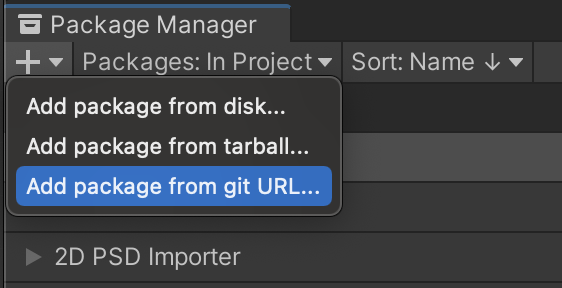
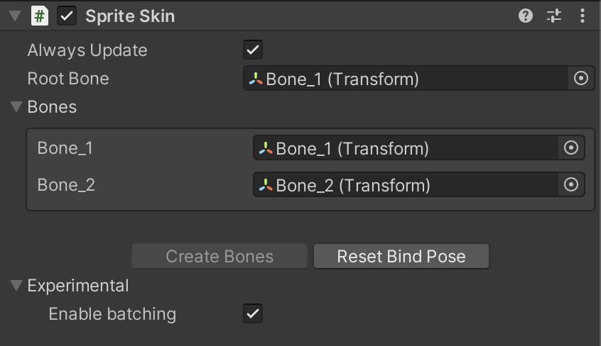
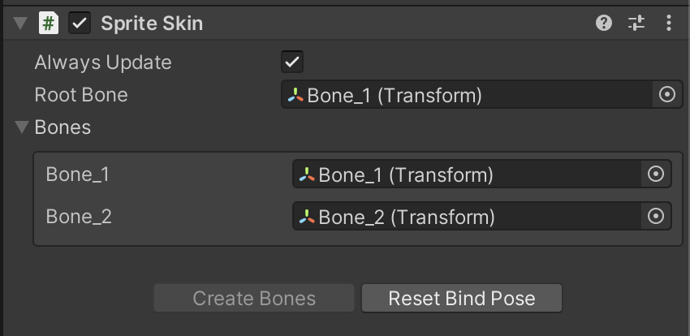

# Introduction to 2D Animation

This documentation contains information on how to quickly rig and animate a 2D character in Unity with the 2D Animation package and tools. The following package versions are only supported for the following Unity versions:

* __2D Animation package version 5.x.x__ - Unity 2020.2 or later

* __2D Animation package version 4.x.x__ - Unity 2020.1

* __2D Animation package version 3.x.x__ - Unity 2019.3

## 2D Animation and PSD Importer integration

You can use the __2D Animation package__ with the [PSD Importer](https://docs.unity3d.com/Packages/com.unity.2d.psdimporter@latest) package to easily import your character artwork from Photoshop into Unity for animation. The __PSD Importer__ is an Asset importer that supports the import of Adobe Photoshop .psb files into Unity and generating a Prefab made of Sprites based on the source file and its layers (see Adobe’s documentation on [Layer basics](https://helpx.adobe.com/photoshop/using/layer-basics.html)). 

The [.psb](https://helpx.adobe.com/photoshop/using/file-formats.html#large_document_format_psb)[ file format](https://helpx.adobe.com/photoshop/using/file-formats.html#large_document_format_psb) has identical functions as the more common Adobe .psd format, with additional support for much larger image sizes. See the [PSD Importer](https://docs.unity3d.com/Packages/com.unity.2d.psdimporter@latest/index.html) package documentation for more information about the importer’s features.

## Adobe Photoshop PSB format

For character animation with the __2D Animation package__, the __PSD Importer__ package is required. The PSD Importer package currently only imports the __Adobe Photoshop .psb format__, and does not import the Adobe .psd format. The .psb format has identical functions as .psd, and is able to support larger image sizes.

## Sprite Skin component

When the character Prefab is brought into the Scene view, Unity automatically adds the __Sprite Skin__ component to any Sprite that has any [bone influences](SkinEdToolsShortcuts.md#bone-influences). This component is required for the bones to deform the Sprite meshes in the Scene view.

## Optional Performance Boost

When animating your characters, you can improve the runtime performance of the animated Sprite’s deformation by installing both the [Burst](https://docs.unity3d.com/Packages/com.unity.burst@latest) and [Collections](https://docs.unity3d.com/Packages/com.unity.collections@latest) packages from the [Package Manager](https://docs.unity3d.com/Manual/upm-ui.html). This allows the 2D Animation package to use Burst compilation to speed up Unity’s processing of Sprite mesh deformation.

The **Burst** package is visible by default in the **Package Manager**, however the **Collections** package is not. To install the **Collections** package, follow these steps:
1. Open the **Package Manager**.
2. Press **+** at the upper-left corner of the **Package Manager** window to open a drop-down menu, then select **Add package from git URL…** from the list of options.    
3. In the **Name** box, enter “com.unity.collections”, then select **Add**.   

After completing these steps, the **Collections** package is added to the Project.

 The **Sprite Skin** component settings.

With both packages installed, __Enable batching__ becomes available in the [Sprite Skin component](SpriteSkin.md) properties. Note that if you do not have the required packages installed, the option will not be visible.

 

The package has been tested with [Burst](https://docs.unity3d.com/Packages/com.unity.burst@latest) version 1.4.1 and [Collections](https://docs.unity3d.com/Packages/com.unity.collections@latest) version 0.9.0-preview.6. However if you encounter any bugs, you can turn the optional performance boost off by clearing the __Enable batching__ option.
