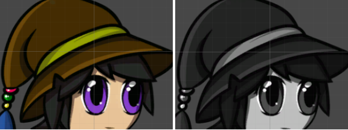
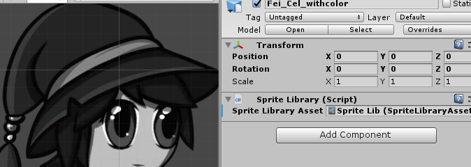

# Swapping Sprite Library Assets

If swapping each Sprite individually takes too much effort, you can instead swap the entire __Sprite Library Asset__ to another one containing alternate Sprites.

The following example shows how to switch from a Sprite Library Asset of color Sprites to another one containing identical Sprites but in grayscale:

 __Left:__ Prefab with the colored Sprite Library Asset. __Right:__ Prefab with the grayscale Sprite Library Asset.

1. Create variants of your character artwork. In this example, a grayscale variant of the original artwork was created in Photoshop (or any other compatible image editor).

2. [Import](PreparingArtwork.md) both .psb files into the Unity Editor. Both become separate Prefabs in the Asset window.

3. Select the color Prefab and open it in the [Skinning Editor](SkinningEditor.md). Assign each Sprite of the character to a unique [Category](SpriteVis.html#how-to-create-a-category). It is suggested to name each __Category__ and __Label__ after the respective body part of the character. Apply the changes once you are ready, and exit the __Sprite Editor__.

    The Category and Label names for the color Prefab.

4. Select the grayscale Prefab, and give its corresponding Sprites the same __Category__ and __Label__ names as the color Prefab. 

    Give the same Category and Label names to the grayscale Prefab.

5. Drag the color Prefab into the Scene view, and go to the root GameObject. The [Sprite Library component](SLAsset.html#sprite-library-component) is attached to the root GameObject and refers to the default __Sprite Library Asset__ that [Unity automatically generated](SpriteSwapIntro.html#how-unity-generates-sprite-swap-assets-and-components).  

    The color Sprite Library Asset.

6. With the Inspector window the color Prefab remaining open, go to the Asset window and expand the grayscale Prefab. Find the grayscale Prefab __Sprite Library Asset__ and drag it to the color Prefab‘s __Sprite Library Asset__ box, which replaces the color Prefab’s original Sprite Library Asset.

7. The Sprites of the color Prefab should have switched to their grayscale counterparts of the grayscale Sprite Library Asset.

    The grayscale version of the color Sprite Library Asset.