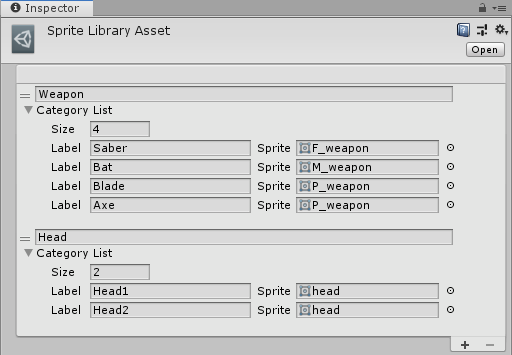
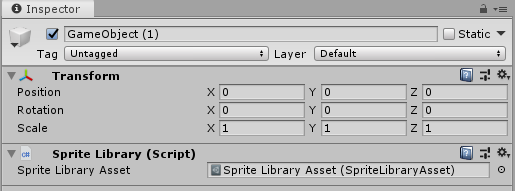
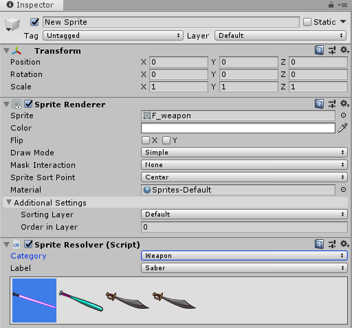

## Sprite Library Asset

The __Sprite Library Asset__ contains the __Categories__ and __Labels__ that a character Prefab refers to to determine what Sprites are rendered. This allows you to group similar or interchangeable Sprites together that can be used for [Sprite Swapping](SpriteSwapIntro.md).

Unity automatically generates a Sprite Library Asset as a sub-Asset of the Prefab when you create any [Categories or Labels](SpriteVis.html#sprite-tab) while editing the character Prefab. To [manually](SSManual.md) create a __Sprite Library Asset__, go to __Assets__ > __Create__ > __2D__ > __Sprite Library Asset__.

 Inspector view of Sprite Library Asset

Select __Add (+)__ at the bottom-right of the __Sprite Library Asset__ to add a new __Category__. Select __Remove (-)__ to remove a Category instead.

| Property                           | Function                                                     |
| ---------------------------------- | ------------------------------------------------------------ |
| __Category Name__                  | Enter a Category name. Category names must be unique.        |
| __Category List__                  | Use these settings to define the number of Sprites you want to include, and the label for each Sprite. |
| &nbsp;&nbsp;&nbsp;&nbsp;__Size__   | Enter the number of Labels you want to assign to this Category. |
| &nbsp;&nbsp;&nbsp;&nbsp;__Label__  | Enter a name for the registered Sprite. This Label must be unique from other Labels in the same Category. |
| &nbsp;&nbsp;&nbsp;&nbsp;__Sprite__ | Select or drag a Sprite onto this box to register it as the Sprite reference for this Label. |

## Sprite Library component

The __Sprite Library component__ is attached to the root GameObject of the character Prefab. Assign your preferred [Sprite Library Asset](SLAsset.md) to the __Sprite Library Asset__ box that the [Sprite Renderers](https://docs.unity3d.com/Manual/class-SpriteRenderer.) of the GameObjects within the Prefab will refer to and render respectively.

 Inspector view of Sprite Component

| Property                 | Function                                                     |
| ------------------------ | ------------------------------------------------------------ |
| __Sprite Library Asset__ | Set this to the Sprite Library Asset you want to use for this charcter Prefab. |

## Sprite Resolver component

The __Sprite Resolver component__ is attached to each GameObject in the Prefab. The component pulls information from the [Sprite Library Asset](SLAsset.md) (assigned to the [Sprite Library component](SLComponent.md) at the root of the Prefab). The component contains two properties - [Category and Label](SpriteVis.html#sprite-tab) - and a visual Variant Selector that displays thumbnails of the Sprites contained in the Sprite Library Asset. 

 Inspector view of Sprite Resolver Component, with the variant visual selector.

| Property     | Function                                                     |
| ------------ | ------------------------------------------------------------ |
| __Category__ | Select which Category you want to use a Sprite from for this GameObject. |
| __Label__    | Select the Label of the Sprite you want to use for this GameObject. |

Select the Sprite you want the __Sprite Renderer__ to render by selecting from the __Category__ and __Label__ dropdown menus, or select the Sprite directly in the visual Variant Selector.

## Sprite Skin component

When the character Prefab is brought into the Scene view, the PSD Importer automatically adds the __Sprite Skin__ component to any Sprite that have any [bone influences](SkinEdToolsShortcuts.md#bone-influences). 