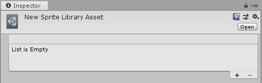
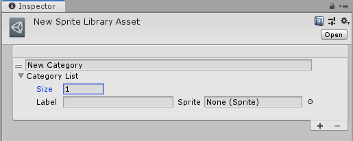
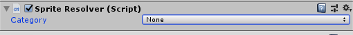

# Sprite Swap manual setup

When a [Category or Label](SpriteVis.html#how-to-create-a-category) is created from the [Sprite Visibility panel](SpriteVis.md) in the __Skinning Editor__, Unity automatically [generates](SpriteSwapIntro.html#how-unity-generates-sprite-swap-assets-and-components) a __Sprite Library Asset__ as a sub-Asset of the [character Prefab](PreparingArtwork.md) that contains the Categories and Labels created for that Prefab.

You can create a __Sprite Library Asset__ manually and choose which GameObject refers to it, by following the steps below:

1. Select the __Sprite Library Asset__ from the Asset creation menu by going to: __Asset > Create > Sprite Library Asset__.

   
   
   
   
2. Select the new Sprite Library Asset and go to its Inspector window. The list of Categories and Labels available in the Asset is displayed.

   
   
   
   
3. Select __Add (+)__ at the bottom-right of the List to add a new __Category__. Enter a name into the ‘New Category’ box. Each Category in the same [Sprite Library Asset](SLAsset.md) must have a name unique from others.

   
   
   
   
4. Next, create an empty GameObject (menu: __Right-click on the Hierarchy window > Create Empty__). Select it and then add the [Sprite Renderer](https://docs.unity3d.com/Manual/class-SpriteRenderer.html) component to it.
   
   
   
   
   
5. Add the [Sprite Library component](SLAsset.html#sprite-library-component) to the same GameObject. Assign the Sprite Library Asset created in step 3 to the __Sprite Library Asset__ box.

   

   

6. Add the [Sprite Resolver component](SLAsset.html#sprite-resolver-component) to the same GameObject. 

   

   Open the **Category** drop-down menu, and select a Category you created in step 3. The component will then display a **Label** drop-down menu and a Visual Variant Selector that displays thumbnails of the different Sprites available in the Category.

   

   

7. When you select a Sprite in the __Sprite Resolver__ component, Unity automatically replaces the current Sprite in the[ Sprite Renderer](https://docs.unity3d.com/Manual/class-SpriteRenderer.html) component with the one you have selected.
