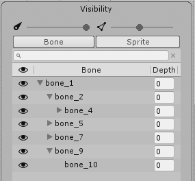
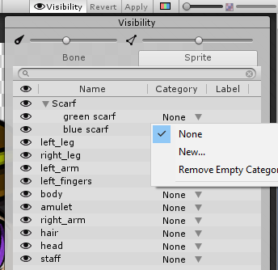
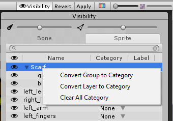

# Sprite Visibility panel

Toggle the __Sprite Visibility__ panel by selecting the __Visibility tool__ button along the top right of the editor window: 

The panel appears on the right-side of the editor window. It has two sliders at the top that control the visibility of the bones and Sprite meshes within the editor window. Move either slider further to the left to decrease the visibility of the bones or meshes respectively, and to the right to increase their visibility. 

The panel has two main tabs - __Bone__ and __Sprite__.  The Bone tab displays the [Bone hierarchy](#bone-tab-and-hierarchy-tree) of the character Prefab, and the Sprite tab displays the names of the Sprites, their grouping hierarchy, and __Category__ and __Label__ information.

## Bone tab and hierarchy tree

 The Bone tab selected.

Select the __Bone__ tab to view the list of bones in the character Prefab. The list reflects the hierarchy of bones you created with the [Bone tools](SkinEdToolsShortcuts.html#bone-tools). You can reparent and reorder bones directly from the bone tab by dragging selected bones up and down the list. Toggle the visibility of each bone by selecting the  icon next to it.

| Property                        | Function                                                     |
| ------------------------------- | ------------------------------------------------------------ |
|  | Toggle the visibility of each bone by selecting this icon next to the bone. |
| __Bone__                        | The name of the Bone.                                        |
| __Depth__                       | The render order of bones that are influencing the same Sprite Mesh. The parts of the Mesh that is influenced by a bone with higher bone Depth value will overlay the parts influenced by bones with lower Depth value.  A bone’s Depth value is 0 by default. To set a bone’s Depth value, select one of the available [Bone tools](SkinEdToolsShortcuts.html#bone-tools) and then select one of the bones. Find the [Bone panel](SkinEdToolsShortcuts.html#bone-panel) at the bottom right of the window, and enter the desired value to its __Depth__ property box. |

## Sprite tab

Select the __Sprite tab__ to see the list of Sprites that make up the character Prefab in the Skinning editor window. The names  and order of the Sprites mirror their names, layer and grouping order in the original source file.

The Sprite tab has two additional columns for the __Category__ and __Label__ of each Sprite in the character Prefab. A __Category__ contains a selection of Sprites that are differentiated by their __Labels__, and this information is contained in the [Sprite Library Asset](SLAsset.md) that is a sub-Asset of the character Prefab. Changing the Category and Labels of Sprites allows you to [Sprite Swap](SLASwap.md),  which allows you to create [frame-by-frame animations](FFanimation.md) and [other uses](Examples.md).

## How to create a Category

1. Go to the row of the Sprite, open the drop-down menu on the Category column and select __New__.

   

   

2. Enter a name for the Category. This name must be unique among other Categories within the same Library Asset.

3. When you enter a Category name, Unity automatically assigns that Sprite a Label based on the Sprite’s name, which you can edit. Labels belonging to the same Category must have unique names.

4. To assign the Sprite to an existing Category, open the drop-down menu on the Category column along its roll, and select from the list of existing Categories.

   

## Context menu options

There are context menu options available from the Visibility panel to create Categories and Labels based on the imported groups and layer names of the Sprites. Open the context menu by right-clicking the row of the Sprite or Group you want to convert to a Category.

| Option                        | Function                                                     |
| ----------------------------- | ------------------------------------------------------------ |
| __Convert Group to Category__ | This option is only available if the selected row is a Group that contains multiple Sprites. Select this option to assign all Sprites in the group to a new Category. Unity automatically names the new Category with the root Group name. |
| __Convert Layer to Category__ | Select this option to assign the Sprite to a Category based on the Sprite’s name. Unity also uses the Sprite's name as the Label name. |
| __Clear All Category__        | Select this to remove all selected Sprites from their currently assigned Categories. |